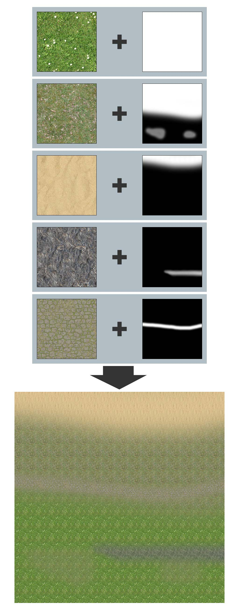
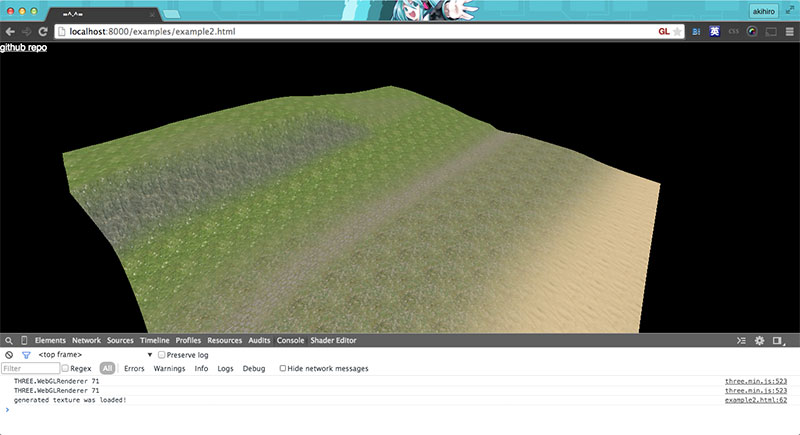

# layeredTextureGen

One of progrem with WebGL for the web is loading huge textures. It causes long loading times. layeredTextureGen.js is the solution for that. layeredTextureGen.js can generate huge textures from small tile images and mask images in JavaScript.

In this example, both tiles and masks are 256 x 256 pixel each. A totall of less than 200KB images generate a 2MB image.



Then you can apply it to THREE.Mesh.



## Live demos

- [example1: basic usage](http://yomotsu.github.io/layeredTextureGen/examples/example1.html)
- [example2](http://yomotsu.github.io/layeredTextureGen/examples/example2.html)

## Usage

Include both [three.js](https://github.com/mrdoob/three.js/) and layeredTextureGen.js
```
<script src="../lib/three.min.js"></script>
<script src="../layeredTextureGen.js"></script>
```

Then, write JS code with three.js as usual. `layeredTextureGen.generate()` function will return a THREE.Texture instance. You can use it as texture with materials for three.js.

```
<script>
var width  = window.innerWidth;
var height = window.innerHeight;
var scene = new THREE.Scene();
var camera = new THREE.PerspectiveCamera( 60, width / height, 1, 1000 );
camera.position.set( 0, 10, 10 );
camera.lookAt( scene.position );

var renderer = new THREE.WebGLRenderer();
renderer.setSize( width, height );
document.body.appendChild( renderer.domElement );


var layer1 = new layeredTextureGen.Layer( {
  tileURL: './images/grass1.jpg',
  maskURL: './images/mask1.jpg',
  tileRepeat: new THREE.Vector2( 12, 12 )
} );

var layer2 = new layeredTextureGen.Layer( {
  tileURL: './images/grass2.jpg',
  maskURL: './images/mask2.jpg',
  tileRepeat: new THREE.Vector2( 12, 12 )
} );

var layer3 = new layeredTextureGen.Layer( {
  tileURL: './images/sand.jpg',
  maskURL: './images/mask3.jpg',
  tileRepeat: new THREE.Vector2( 12, 12 )
} );

var layer4 = new layeredTextureGen.Layer( {
  tileURL: './images/stone.jpg',
  maskURL: './images/mask4.jpg',
  tileRepeat: new THREE.Vector2( 12, 12 )
} );

var layeredTexture = layeredTextureGen.generate( 2048, 2048, renderer, [
  layer1, // bottom
  layer2,
  layer3,
  layer4  // top
] );

layeredTexture.addEventListener( 'loaded', function () {

  console.log( 'generated texture was loaded!' );

  // you can get the texture as an image like this, if you need
  // document.body.appendChild( layeredTexture.image )

} );


var plane = new THREE.Mesh(
  new THREE.PlaneBufferGeometry( 100, 100 ),
  new THREE.MeshBasicMaterial( { map: layeredTexture } )
);
scene.add( plane );


( function animate () {

  requestAnimationFrame( animate );
  renderer.render( scene, camera );

} )();

</script>
```
